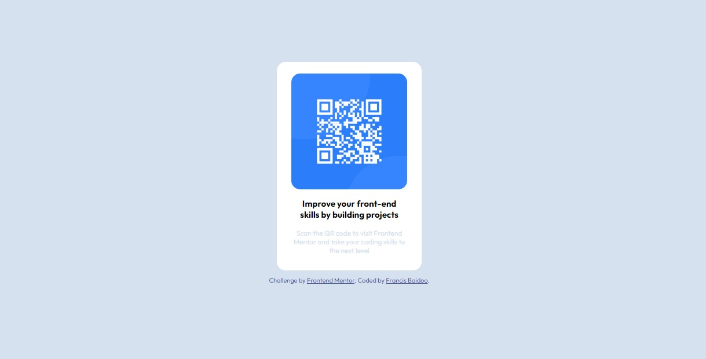

# Frontend Mentor - QR code component solution

This is a solution to the [QR code component challenge on Frontend Mentor](https://www.frontendmentor.io/challenges/qr-code-component-iux_sIO_H). Frontend Mentor challenges help you improve your coding skills by building realistic projects. 

## Table of contents

- [Overview](#overview)
  - [Screenshot](#screenshot)
  - [Links](#links)
- [My process](#my-process)
  - [Built with](#built-with)
  - [What I learned](#what-i-learned)
  - [Continued development](#continued-development)
  - [Useful resources](#useful-resources)
- [Author](#author)
- [Acknowledgments](#acknowledgments)

**Note: Delete this note and update the table of contents based on what sections you keep.**

## Overview

### Screenshot




### Links

- Solution URL: [Add solution URL here](https://www.frontendmentor.io/challenges/qr-code-component-iux_sIO_H/hub/qr-code-component-solution-9eUwnoPBxQ)
- Live Site URL: [Add live site URL here](https://kwawbaidoo.github.io/QR-code-component/)

## My process

### Built with

- Semantic HTML5 markup
- CSS custom properties
- Flexbox
- CSS Grid


### What I learned

As a beginner I have learnt a lot from this project. I have previously read about the semantic HTML5,
and practical i have been able to codeto see the output.
The use of *classes and IDs* seems like magic when trying to style elements.
Also, how to import image in the *img tag* was a little difficult but I was able to go through it.
Use of *flexbox* was awesome and ready to learn more of it and also *CSS Grid*.
Am ready to *learn, un-learn and relearn* from experiece engineers and collegues.


```html


```
```css
.codediv {
  display: flex;
  justify-content: center;
}
```


### Continued development

In the future projecct, will like to learn more on how to use *flexbox and CSS Grid* and *CSS* as a whole to get more
concept before trying to move to javascript.


### Useful resources

- [Font](https://fonts.googleapis.com/css2?family=Outfit:wght@400;700&display=swap) - This helped me for getting the font mean to be used for the project. I really liked this pattern and will use it going forward.
- [EasyLearning](https://www.w3schools.com/) - This is an amazing site which helped me to understand
what i was doing. I'd recommend it to anyone still learning this concept.


## Author

- Frontend Mentor - [@kwawbaidoo](https://www.frontendmentor.io/profile/kwawbaidoo)
- Linkedin - [@francisbaidoo](https://www.linkedin.com/in/francis-baidoo-78709a132)


## Acknowledgments

Will like to thank Authors of *frontend mentor challenge* for allowing to learn for my target goals.
Also, I appreciate *Dr.Ehoneah Obed* for his live Tutorials.

